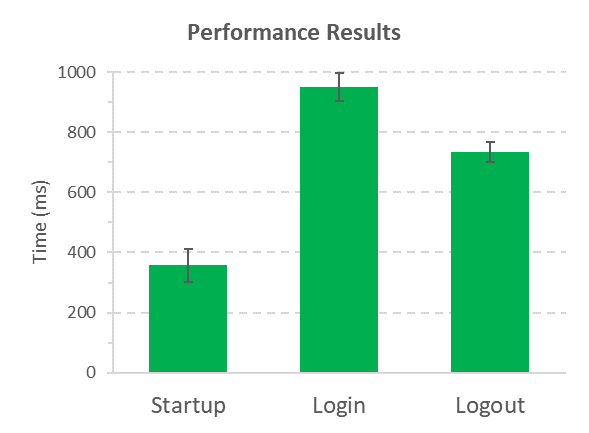

# playwright-performance



To ensure that your application is responsive and performing optimally, it is important to monitor the apparent response time of key procedures. Apparent response time is defined as the time it takes for a procedure to complete and make the application available to the user.
With this [Playwright](https://playwright.dev/) plugin, you can easily add performance analysis to any flow in your tests, whether it's a pure UI, API, or a combination of both. This plugin provides a simple and efficient way to measure the response times of various procedures and identify potential bottlenecks in your application. With this information, you can make informed decisions about optimizations and improvements to enhance the overall performance of your application.

<h2>Installation</h2>
The easiest way to install this module as a (dev-)dependency is by using the following command:

```
npm install playwright-performance --save-dev
```

<h2>Usage</h2>

Import playwright-peformance in your test file as follows:

```
import type { PerformanceOptions, PlaywrightPerformance, PerformanceWorker } from "playwright-performance";
import { playwrightPerformance } from "playwright-performance";
```

<h2>Usage in test</h2>

To use playwright-performance, simply import the playwright-performance object and types, and then extend your test object using test.extend<>(). This will include the performance functionality in your test. No further setup is required. Here's an example:

```
import base from '@playwright/test';
import type { PerformanceOptions, PlaywrightPerformance, PerformanceWorker } from "playwright-performance";
import { playwrightPerformance } from "playwright-performance";

const test = base.extend<PlaywrightPerformance, PerformanceOptions & PerformanceWorker>({
  performance: playwrightPerformance.performance,
  performanceOptions: [{
  }, { scope: 'worker' }],
  worker: [playwrightPerformance.worker, { scope: 'worker', auto: true }]
});

test('startup performance', async ({ page, performance }) => {
    performance.sampleStart("startup");

    await page.goto('http://github.com/');

    performance.sampleEnd("startup");
  });
```

It is possible to get the time span for a single sample inside a test:

```
it("should test github startup performance", () => {
            // ...
            performance.sampleStart("Startup");
            
            browser.url("https://github.com/");
            
            performance.sampleEnd("Startup");

            expect(performance.getSampleTime("Startup")).to.be.at.most(1000);         
        });
```

<h2>Options</h2>
You can override the default options values in the `performanceOptions` fixture object as follows:

```
const test = base.extend<PlaywrightPerformance, PerformanceOptions & PerformanceWorker>({
  performance: playwrightPerformance.performance,
  performanceOptions: [{
    disableAppendToExistingFile: false,
    performanceResultsFileName: "performance-results",
    dropResultsFromFailedTest: false,
    performanceResultsDirectory: "performance-results-dir",
    analyzeByBrowser: false,
  }, { scope: 'worker' }],
  worker: [playwrightPerformance.worker, { scope: 'worker', auto: true }]
});
```

<h3>disableAppendToExistingFile</h3>

When set to `true`, tests from new worker will overwrite any existing performance data.
When set to `false` (default), performance data will be added to the existing data.

<h3>performanceResultsFileName</h3>

You can set the default results file name (`performance-results`).
A newly created results file normally overwrites the old file. If you want to keep old files, it is recommended to add a timestamp to the file name. For example:

```
...
performanceResultsFileName: `performance-results_${new Date().getHours()}`
...
```

<h3>dropResultsFromFailedTest</h3>

Default is `false`. When the value is set to `true`, performance analysis from failed tests would be excluded.

<h3>performanceResultsDirectory</h3>
You can override the default path for the results directory in the project's root dir.
For example:

```
...
performanceResultsFileName: "results-dir/performance-total-results"
...
```

<h3>analyzeByBrowser</h3>
Default is `false`. If true, the performance data would be grouped also by the browser type.

<h2>Getting the results</h2>

A new results directory (the default directory name is `performance-results`) is created in your project's root folder and when all the tests are completed two files are created inside it: `performance-results.json` and `performance-results.csv`. The analyzed data includes: average time, standard error of mean(sem), number of samples, min value, max value, earliest time and latest time.
The results table is also printed to the terminal log.

<h2>Typescript support</h2>

Typescript is supported for this plugin.